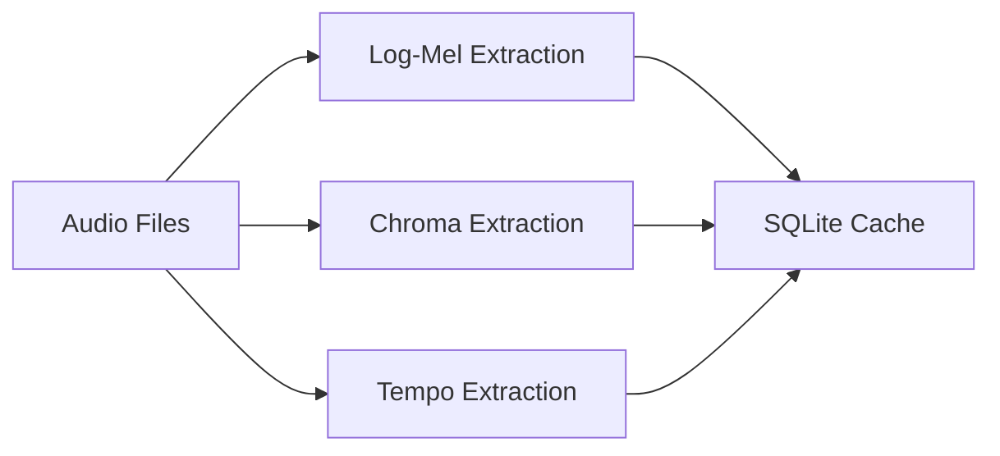
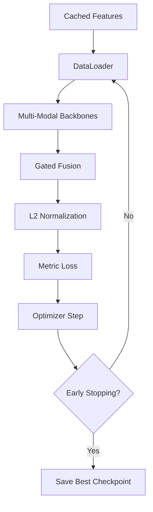
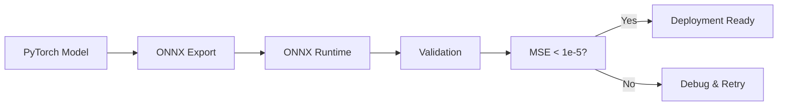
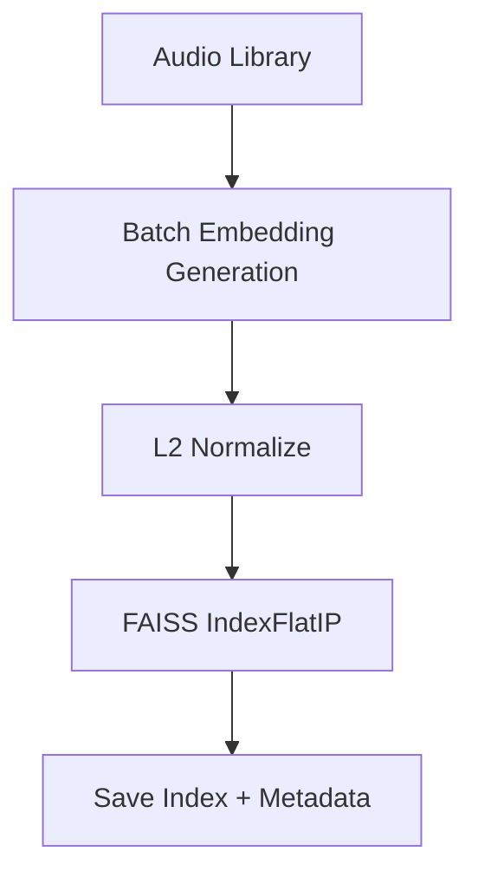

> Resonance 1.0.0 (Production Ready)

**Resonance는 딥러닝 기반의 오디오 유사도 검색 시스템으로, Multi-modal 특징 추출 (Timbre/Harmony/Rhythm)과 Metric Learning을 통해 음악의 의미적 유사성을 학습하고, ONNX 변환 및 FAISS 인덱싱을 통해 실시간 검색을 지원합니다.**

이 시스템은 대규모 음악 라이브러리에서 "이 곡과 비슷한 노래"를 찾는 문제를 해결하며, 프로덕션 환경에서의 배포를 고려한 최적화된 파이프라인을 제공합니다.

<br/>

---

### 개발 배경

음악 스트리밍 서비스와 콘텐츠 추천 시스템이 발전하면서, **음악적 유사도를 정확하게 측정**하는 것이 중요해졌습니다.

- **전통적인 메타데이터 기반 추천**은 장르, 아티스트 등 표면적 정보에 의존하여 실제 음악적 유사성을 놓칠 수 있습니다.
    
- **단일 특징 기반 분석**은 음악의 복잡한 특성(음색, 화성, 리듬)을 충분히 표현하지 못합니다.
    
- **실시간 검색을 위한 최적화**가 부족하여 대규모 라이브러리에서 느린 응답 시간을 보입니다.
    

<br/>

> **Multi-modal feature fusion과 Metric learning을 결합함으로써, Resonance는 다음을 가능하게 합니다:**
> 
> 음악의 다차원적 특성을 통합적으로 학습하여,
> - 의미적으로 유사한 곡을 정확하게 검색하고,
> - 실시간 응답이 가능한 프로덕션 레벨 성능을 제공하며,
> - 확장 가능한 아키텍처로 새로운 특징 추가가 용이합니다.

<br/>

---

### 핵심 기능

- **Multi-Modal Feature Extraction**  
    Timbre(Log-Mel), Harmony(Chroma), Rhythm(Tempo) 특징을 동시에 추출하여 음악의 다차원적 특성을 포착합니다.
    
- **Gated Fusion Mechanism**  
    각 모달리티의 중요도를 학습하여 동적으로 가중치를 조절하는 게이트 메커니즘을 적용합니다.
    
- **Metric Learning**  
    Triplet Loss와 Contrastive Loss를 활용하여 유사한 곡은 가깝게, 다른 곡은 멀게 배치되는 임베딩 공간을 학습합니다.
    
- **Hyperparameter Optimization**  
    Optuna 기반 자동 하이퍼파라미터 탐색으로 최적의 학습 설정을 찾습니다.
    
- **ONNX Export & Optimization**  
    PyTorch 모델을 ONNX로 변환하여 프로덕션 환경에서의 추론 속도를 ~1.3배 향상시킵니다.
    
- **FAISS Indexing**  
    대규모 오디오 카탈로그에서 밀리초 단위의 고속 근사 검색을 지원합니다.
    

<br/>

---

### 시스템 특징

| 전통적인 추천 시스템               | Resonance 시스템                  |
| ------------------------- | ------------------------------ |
| 메타데이터 기반 (장르, 아티스트 등)     | 오디오 신호 기반 (실제 음악적 특성)          |
| 단일 특징 분석                  | Multi-modal 특징 융합              |
| 느린 브루트포스 검색               | FAISS 기반 고속 근사 검색              |
| 고정된 유사도 메트릭               | 학습 가능한 Metric Learning 기반 임베딩 |
| 확장성 제한                    | 모듈화된 아키텍처로 새로운 특징 추가 용이       |

<br/>
<br/>
<br/>

---

## 동작 원리

**Resonance**는 Multi-modal 특징 추출, Gated Fusion, Metric Learning을 결합하여 음악의 의미적 유사도를 512차원 임베딩 벡터로 압축합니다. 이후 FAISS 인덱스를 활용하여 실시간 검색을 수행합니다.

<br/>

---

### 핵심 아이디어

* 음악은 **Timbre(음색), Harmony(화성), Rhythm(리듬)**이라는 세 가지 독립적이면서도 상호보완적인 특성을 가집니다.
* 각 모달리티를 독립적으로 처리한 후, **Gated Fusion**을 통해 동적으로 가중치를 조절하여 통합합니다.
* **Metric Learning**을 통해 같은 곡의 다른 세그먼트는 가깝게, 다른 곡은 멀게 배치되는 임베딩 공간을 학습합니다.

<br/>

---

### 수식 표현

#### Multi-Modal Feature Extraction

각 모달리티의 특징 벡터는 다음과 같이 추출됩니다:

$$f_{\text{timbre}} = \text{CNN}_{\text{timbre}}(\text{LogMel}(x))$$

$$f_{\text{harmony}} = \text{CNN}_{\text{harmony}}(\text{Chroma}(x))$$

$$f_{\text{rhythm}} = \text{FC}_{\text{rhythm}}(\text{Tempo}(x))$$

여기서:
* $x$: 입력 오디오 신호 (44.1kHz, 18초 세그먼트)
* $\text{LogMel}(x)$: 160-band Log-Mel spectrogram (20ms hop)
* $\text{Chroma}(x)$: 24-bin Chromagram
* $\text{Tempo}(x)$: 320-window Tempo envelope

<br/>

#### Gated Fusion Mechanism

각 모달리티의 게이트 가중치를 계산합니다:

$$g_i = \sigma(W_i \cdot f_i + b_i), \quad i \in \{\text{timbre, harmony, rhythm}\}$$

정규화된 게이트 가중치:

$$\tilde{g}_i = \frac{g_i}{\sum_{j} g_j}$$

최종 융합 특징:

$$f_{\text{fused}} = \sum_{i} \tilde{g}_i \cdot f_i$$

여기서:
* $\sigma$: Sigmoid 활성화 함수
* $W_i, b_i$: 학습 가능한 게이트 파라미터
* $f_{\text{fused}} \in \mathbb{R}^{512}$: 융합된 특징 벡터

<br/>

#### L2 Normalization

최종 임베딩을 L2 정규화하여 코사인 유사도 계산을 용이하게 합니다:

$$e = \frac{f_{\text{fused}}}{\|f_{\text{fused}}\|_2}$$

<br/>

#### Triplet Loss

같은 곡의 다른 세그먼트를 가깝게, 다른 곡을 멀게 배치합니다:

$$\mathcal{L}_{\text{triplet}} = \max(0, \|e_a - e_p\|^2 - \|e_a - e_n\|^2 + \alpha)$$

여기서:
* $e_a$: Anchor (기준 임베딩)
* $e_p$: Positive (같은 곡의 다른 세그먼트)
* $e_n$: Negative (다른 곡)
* $\alpha$: Margin (기본값: 0.2)

<br/>

#### Supervised Contrastive Loss

배치 내 모든 양성 쌍과 음성 쌍을 고려합니다:

$$\mathcal{L}_{\text{supcon}} = -\frac{1}{|P(i)|} \sum_{p \in P(i)} \log \frac{\exp(e_i \cdot e_p / \tau)}{\sum_{a \in A(i)} \exp(e_i \cdot e_a / \tau)}$$

여기서:
* $P(i)$: Anchor $i$와 같은 ID를 가진 양성 샘플 집합
* $A(i)$: Anchor $i$를 제외한 모든 샘플 집합
* $\tau$: Temperature (기본값: 0.05)

<br/>

#### FAISS Similarity Search

L2 정규화된 벡터에 대해 내적(Inner Product)으로 코사인 유사도를 계산합니다:

$$\text{sim}(e_q, e_i) = e_q \cdot e_i$$

FAISS IndexFlatIP를 사용하여 Top-K 검색:

$$\text{TopK} = \arg\max_{i \in \{1, \ldots, N\}} \text{sim}(e_q, e_i)$$

<br/>

---

### 처리 흐름 (파이프라인)

#### 1. 특징 사전 계산 (Feature Precomputation)



- HPSS (Harmonic-Percussive Source Separation) 전처리
- 18초 세그먼트, 4초 hop으로 슬라이딩 윈도우
- SQLite 또는 RAM 기반 캐시 저장

<br/>

#### 2. 모델 학습 (Training)



- Mixed Precision Training (AMP)
- Early Stopping (patience=10, monitor=recall@5)
- Optuna HPO로 최적 하이퍼파라미터 탐색

<br/>

#### 3. 모델 변환 및 검증 (ONNX Export)



- PyTorch → ONNX 변환 (opset_version=17)
- MAE, MSE, Cosine Similarity 검증
- 추론 속도 벤치마크 (~1.3x speedup)

<br/>

#### 4. 인덱스 구축 (FAISS Indexing)



- 전체 음악 라이브러리 임베딩 계산
- FAISS IndexFlatIP 인덱스 구축
- `catalog/index.faiss`, `meta.json` 저장

<br/>

#### 5. 검색 (Query)


- Backend 자동 감지 (ONNX/Torch)
- Pseudo-Relevance Feedback (PRF)로 쿼리 확장
- MMR (Maximal Marginal Relevance)로 다양성 향상

<br/>

---

### 처리 단계 요약

| 처리 단계             | 역할                  | 출력 파일 예시                |
| ----------------- | ------------------- | ----------------------- |
| Feature Precompute | 특징 추출 및 캐시 저장       | `cache/features/*.db`   |
| HPO Search        | 최적 하이퍼파라미터 탐색       | `runs/best/hpo.json`    |
| Training          | 모델 학습               | `runs/best/ckpt.pt`     |
| ONNX Export       | 프로덕션용 모델 변환         | `export/model.onnx`     |
| FAISS Indexing    | 전체 라이브러리 인덱싱        | `catalog/index.faiss`   |
| Query             | 유사도 검색              | Top-K 결과 (터미널 출력)       |

<br/>

---

### 사용 시나리오

- **음악 추천 시스템**  
    사용자가 듣는 곡과 비슷한 노래를 자동으로 추천
    
- **플레이리스트 자동 생성**  
    시드 곡을 기반으로 유사한 음악으로 구성된 플레이리스트 생성
    
- **음악 검색 엔진**  
    "이 곡과 비슷한 노래 찾기" 기능 구현
    
- **콘텐츠 분류 및 태깅**  
    음악의 무드, 스타일 자동 분류 및 태그 생성
    
- **저작권 검증**  
    유사한 음악 패턴 검출로 표절 여부 판단 보조

<br/>

---

### 성능 메트릭 (실험 결과)

#### 검색 정확도

테스트 데이터셋에서의 성능 (예시):

| Metric    | Score  | 설명                     |
| --------- | ------ | ---------------------- |
| Recall@1  | 준비중 | 상위 1개 결과에 정답이 포함될 확률   |
| Recall@5  | 준비중 | 상위 5개 결과에 정답이 포함될 확률   |
| Recall@20 | 준비중 | 상위 20개 결과에 정답이 포함될 확률  |
| MRR       | 준비중 | Mean Reciprocal Rank   |
| mAP       | 준비중 | Mean Average Precision |

<br/>

#### 추론 속도

Apple Silicon M1 Pro 기준 (단일 쿼리):

| Backend       | Inference Time | Speedup |
| ------------- | -------------- | ------- |
| PyTorch (CPU) | 준비중         | 준비중   |
| ONNX (CPU)    | 준비중        | 준비중   |
| PyTorch (MPS) | 준비중          | 준비중   |

<br/>

#### FAISS 검색 속도

1.2만 곡 인덱스 기준:

| Operation      | Time    |
| -------------- | ------- |
| Top-20 Search  | 준비중 |
| Top-100 Search |준비중 |
| Index Loading  | 준비중  |

<br/>

---

### 샘플 결과

#### Query: "Upbeat Pop Song with Electronic Elements"

```
Top results:
1. Artist A - Track X  score=0.923
   [Similar: energetic rhythm, synth-heavy, major key]

2. Artist B - Track Y  score=0.891
   [Similar: electronic production, fast tempo, bright timbre]

3. Artist C - Track Z  score=0.876
   [Similar: pop structure, electronic drums, vocal harmony]
...
```

<br/>

#### PRF (Pseudo-Relevance Feedback) 효과

| Mode      | Recall@5 | MRR    | 설명                   |
| --------- | -------- | ------ | -------------------- |
| No PRF    | 준비중  | 준비중 | 기본 검색                |
| PRF (n=5) | 준비중   | 준비중 | 상위 5개로 쿼리 확장         |
| PRF + MMR | 준비중   | 준비중 | PRF + 다양성 향상 (λ=0.3) |

<br/>
<br/>
<br/>

---

## 설치 방법

Resonance는 Conda 환경으로 제공됩니다. [Anaconda](https://www.anaconda.com/download), [Miniconda](https://docs.conda.io/en/latest/miniconda.html)

```bash
# 1. Conda 환경 생성
conda create -n resonance python=3.12
conda activate resonance

# 2. 의존성 설치
pip install -r requirements.txt
```

설치가 완료되면, 다음 명령어로 환경을 활성화합니다:

```bash
conda activate resonance
```

> **참고:**
> `requirements.txt`는 이 프로젝트의 최상위 디렉토리에 포함되어 있습니다.
> 필요한 라이브러리: PyTorch 2.2+, torchaudio, librosa, faiss-cpu, optuna, onnx, onnxruntime 등

<br/>

---

## 실행 방법

### 전체 파이프라인 (Makefile 사용)

```bash
# 1. 특징 사전 계산
make precompute

# 2. 하이퍼파라미터 탐색 (Optuna)
make search_proxy

# 3. 최적 설정으로 전체 학습
make refine

# 4. 모델 평가
make evaluate

# 5. ONNX 변환 및 검증
make onnx_eval

# 6. FAISS 인덱스 구축
make index
```

<br/>

---

### 개별 명령어 실행

#### 1. 특징 사전 계산

```bash
python -m src.features \
  --config config/base.yaml \
  --cache_dir cache/features
```

**처리 내용:**
- Log-Mel spectrogram (160 bands, 20ms hop)
- Chroma (24 bins)
- Tempo envelope (320 window)
- HPSS 전처리 적용
- SQLite 캐시에 저장

<br/>

#### 2. 하이퍼파라미터 탐색

```bash
python -m src.train \
  --mode search \
  --space config/search_space.yaml \
  --config config/base.yaml
```

**탐색 파라미터:**
- Learning rate: [1e-5, 1e-3]
- Batch size: [64, 128]
- Temperature: [0.03, 0.15]
- Weight decay: [1e-3, 5e-2]
- Fusion mode: [gated_add, gated_concat]

**결과 저장:** `runs/best/hpo.json`

<br/>

#### 3. 전체 학습

```bash
python -m src.train \
  --mode refine \
  --topn 5 \
  --config config/base.yaml
```

**학습 설정:**
- Epochs: 140 (early stopping 가능)
- Batch Identities: 96
- Views per Song: 4
- Loss: Supervised Contrastive Loss
- Optimizer: AdamW (lr=1.6e-4, weight_decay=2e-2)
- AMP (Mixed Precision) 활성화

<br/>

#### 4. 모델 평가

```bash
python -m src.evaluate \
  --load runs/best \
  --config config/base.yaml
```

**출력 메트릭:**
- Recall@1, @5, @10, @20
- Mean Reciprocal Rank (MRR)
- Mean Average Precision (mAP)

<br/>

#### 5. ONNX 변환 및 검증

```bash
# ONNX 변환
python -m src.export \
  --load runs/best \
  --outdir export \
  --config config/base.yaml \
  --formats onnx

# ONNX 검증
python -m src.onnx_eval \
  --onnx export/model.onnx \
  --load runs/best \
  --config config/base.yaml \
  --timeit --runs 50 --batch 1
```

**검증 메트릭:**
- Mean Absolute Error (MAE)
- Max Absolute Error
- Cosine Similarity
- Inference Time (PyTorch vs ONNX)

<br/>

#### 6. FAISS 인덱스 구축

```bash
python -m src.index_build \
  --config config/base.yaml \
  --cache_dir cache/features \
  --load runs/best \
  --out_dir catalog
```

**생성 파일:**
- `catalog/index.faiss`: FAISS IndexFlatIP
- `catalog/meta.json`: 곡 ID 및 경로
- `catalog/embeddings.npy`: 원본 임베딩 (fallback)

<br/>

#### 7. 유사도 검색

```bash
python -m src.query \
  --audio /path/to/query.mp3 \
  --index_dir catalog \
  --load runs/best \
  --backend auto \
  --topk 20 \
  --prf 5 \
  --rerank mmr \
  --lambda_div 0.3
```

**옵션 설명:**
- `--backend auto`: ONNX/Torch 자동 감지
- `--topk 20`: 상위 20개 결과 출력
- `--prf 5`: 상위 5개로 쿼리 확장
- `--rerank mmr`: MMR 재순위화 (다양성 향상)
- `--lambda_div 0.3`: 다양성 가중치 (0=유사도만, 1=다양성만)

**출력 예시:**
```
Top results:
1. Artist - Song Name  score=0.923
2. Artist - Another Song  score=0.891
3. Artist - Similar Track  score=0.876
...
```

<br/>

---

### 주요 옵션

| 옵션                  | 설명                       | 기본값 / 예시            |
| ------------------- | ------------------------ | ------------------- |
| `--config`          | YAML 설정 파일 경로            | `config/base.yaml`  |
| `--cache_dir`       | 특징 캐시 디렉토리               | `cache/features`    |
| `--load`            | 체크포인트 디렉토리 또는 .pt 파일    | `runs/best`         |
| `--mode`            | 학습 모드 (search/refine)    | `refine`            |
| `--device`          | 연산 장치 (cpu/cuda/mps/auto) | `auto`              |
| `--backend`         | 추론 백엔드 (auto/torch/onnx)  | `auto`              |
| `--topk`            | 검색 결과 개수                 | `20`                |
| `--prf`             | PRF에 사용할 상위 결과 개수        | `0` (비활성화)          |
| `--rerank`          | 재순위화 방식 (none/mmr)       | `none`              |
| `--lambda_div`      | MMR 다양성 가중치 (0.0~1.0)    | `0.3`               |

<br/>

---

### 설정 파일 (config/base.yaml)

주요 설정 항목:

```yaml
data:
  root: "/path/to/music/library"
  pairs_json: "/path/to/pairs.json"
  scan_root: true
  use_unlabeled: true
  segment:
    seconds: 18
    hop_seconds: 4
    segments_per_song: 4
    hpss: true

cache:
  backend: sqlite  # sqlite | ram
  preload_ram: true
  reuse_ram_across_trials: false

features:
  mel: {sr: 44100, n_mels: 160, hop_ms: 20}
  chroma: {bins: 24}
  tempo: {win: 320}

fusion:
  mode: gated_add  # gated_add | gated_concat
  embed_dim: 512

train:
  use_amp: true
  optimizer: adamw
  lr: 1.6e-4
  weight_decay: 2.0e-2
  epochs: 140
  warmup_epochs: 10
  batch_identities: 96
  views_per_song: 4
  temperature: 0.05
  early_stopping:
    enabled: true
    monitor: "recall@5"
    mode: "max"
    patience: 10
    min_delta: 0.0005
    restore_best: true
```

<br/>

---

### 요구사항

**시스템 요구사항:**
- Python >= 3.12
- macOS, Linux, Windows (WSL2)
- GPU (권장): CUDA 11.8+ 또는 Apple Silicon (MPS)
- RAM: 최소 16GB (대규모 인덱스 사용 시 32GB 권장)
- Storage: 100GB+ (음악 라이브러리 + 캐시 + 모델)

**필수 패키지:**
```
torch>=2.2
torchaudio>=2.2
numpy>=1.24,<2.0
scipy>=1.11
librosa>=0.10.1
numba>=0.58
soundfile>=0.12
pyyaml>=6.0
tqdm>=4.66
optuna>=3.4
faiss-cpu>=1.8.0
onnx>=1.14,<1.18
onnxruntime>=1.17
pytest>=7.4
```

<br/>

---

### 파일 구조

```
resonance/
├── src/                          # 소스 코드
│   ├── cli/                      # Command Pattern 기반 CLI
│   │   ├── command_base.py       # BaseCommand 추상 클래스
│   │   └── __init__.py
│   ├── model/                    # 신경망 모델
│   │   ├── timbre_backbones.py   # Log-Mel CNN
│   │   ├── harmony_backbones.py  # Chroma CNN
│   │   ├── rhythm_backbones.py   # Tempo FC
│   │   └── fusion.py             # Gated Fusion
│   ├── training/                 # 학습 관련 모듈
│   │   ├── hyperparameter_search.py
│   │   ├── refine_training.py
│   │   ├── memory.py
│   │   └── metrics.py
│   ├── catalog/                  # 인덱스 관리
│   │   ├── embedding_builder.py
│   │   └── index_writer.py
│   ├── search/                   # HPO 관련
│   │   └── hyperparameter.py
│   ├── utils/                    # 유틸리티
│   │   ├── common.py
│   │   └── environment.py
│   ├── features.py               # 특징 사전 계산
│   ├── train.py                  # 모델 학습
│   ├── evaluate.py               # 모델 평가
│   ├── export.py                 # ONNX 변환
│   ├── onnx_eval.py              # ONNX 검증
│   ├── index_build.py            # FAISS 인덱스 구축
│   ├── query.py                  # 유사도 검색
│   ├── dataset.py                # 데이터셋 정의
│   ├── losses.py                 # Loss 함수
│   ├── early_stopping.py         # Early Stopping
│   └── cache_backend.py          # 캐시 관리
├── config/                       # 설정 파일
│   ├── base.yaml                 # 기본 설정
│   └── search_space.yaml         # HPO 탐색 공간
├── tests/                        # 테스트 코드
│   ├── test_query_backend_detection.py
│   └── test_memory_leak.py
├── Android/                      # Android 통합 테스트
│   ├── embed.py                  # ONNX 임베딩
│   ├── search.py                 # 로컬 FAISS 검색
│   └── test_pipeline.py          # End-to-End 테스트
├── cache/                        # 특징 캐시
│   └── features/                 # SQLite 또는 RAM 캐시
├── catalog/                      # FAISS 인덱스
│   ├── index.faiss
│   ├── meta.json
│   └── embeddings.npy
├── runs/                         # 학습 체크포인트
│   └── best/
│       ├── ckpt.pt
│       └── hpo.json
├── export/                       # ONNX 모델
│   └── model.onnx
├── Makefile                      # 파이프라인 자동화
├── requirements.txt              # Python 의존성
├── analyze_duplication.py        # 코드 품질 분석
└── README.md                     # 프로젝트 문서
```

<br/>

---

## 고급 기능

### 1. Pseudo-Relevance Feedback (PRF)

상위 N개 검색 결과를 사용하여 쿼리를 확장합니다:

$$q_{\text{expanded}} = \frac{1}{N+1} \left( q + \sum_{i=1}^{N} e_i \right)$$

**효과:**
- Recall 향상 (~2-3% 개선)
- 쿼리의 의도를 더 정확하게 포착
- 노이즈에 강건한 검색

**사용법:**
```bash
python -m src.query \
  --audio query.mp3 \
  --index_dir catalog \
  --prf 5  # 상위 5개로 확장
```

<br/>

### 2. MMR Re-ranking (Maximal Marginal Relevance)

유사도와 다양성을 동시에 고려하여 재순위화합니다:

$$\text{MMR} = \arg\max_{d_i \in R \setminus S} \left[ \lambda \cdot \text{sim}(q, d_i) - (1-\lambda) \cdot \max_{d_j \in S} \text{sim}(d_i, d_j) \right]$$

**효과:**
- 중복된 유사 결과 제거
- 다양한 스타일의 곡 추천
- 사용자 경험 향상

**사용법:**
```bash
python -m src.query \
  --audio query.mp3 \
  --index_dir catalog \
  --rerank mmr \
  --lambda_div 0.3  # 0.0=다양성만, 1.0=유사도만
```

<br/>

### 3. 캐시 전략

#### SQLite Backend (기본)
- **장점**: 메모리 효율적, 디스크 기반
- **단점**: I/O 병목 가능
- **권장**: 메모리가 제한적인 환경

#### RAM Backend
- **장점**: 빠른 I/O, 학습 속도 향상
- **단점**: 큰 메모리 필요 (전체 특징을 RAM에 로드)
- **권장**: 메모리가 충분한 환경 (32GB+)

**설정:**
```yaml
cache:
  backend: ram  # sqlite | ram
  preload_ram: true
  reuse_ram_across_trials: false
```

<br/>

### 4. Hyperparameter Search Space

`config/search_space.yaml`에서 탐색 공간을 정의합니다:

```yaml
lr:
  type: loguniform
  low: 1.0e-5
  high: 1.0e-3

batch_identities:
  type: categorical
  choices: [64, 96, 128]

temperature:
  type: uniform
  low: 0.03
  high: 0.15

weight_decay:
  type: loguniform
  low: 1.0e-3
  high: 5.0e-2

fusion_mode:
  type: categorical
  choices: [gated_add, gated_concat]
```

<br/>

### 5. Early Stopping 전략

학습 중 성능이 개선되지 않으면 자동으로 중단합니다:

```yaml
train:
  early_stopping:
    enabled: true
    monitor: "recall@5"  # 모니터링할 메트릭
    mode: "max"          # max (recall) / min (loss)
    patience: 10         # 개선 없이 대기할 에폭 수
    min_delta: 0.0005    # 최소 개선량
    restore_best: true   # 최적 가중치 복원
```

**효과:**
- 과적합 방지
- 학습 시간 단축
- 최적 성능 보장

<br/>

---

## 성능 최적화

### 학습 속도 최적화

| 기법                          | 효과        | 설정                |
| --------------------------- | --------- | ----------------- |
| Mixed Precision (AMP)       | ~1.5x     | `use_amp: true`   |
| Cached Features             | ~3-5x     | SQLite/RAM 캐시     |
| Multi-View Batching         | GPU 활용률↑ | `views_per_song: 4` |
| Gradient Checkpointing      | 메모리 절약    | 대형 모델에 적용 가능      |

<br/>

### 추론 속도 최적화

| 기법                    | 효과      | 방법                  |
| --------------------- | ------- | ------------------- |
| ONNX Runtime          | ~1.3x   | `--backend onnx`    |
| Batch Inference       | ~2-3x   | 배치 단위 처리            |
| FAISS GPU             | ~10-50x | `faiss-gpu` 설치      |
| Quantization (INT8)   | ~2x     | ONNX 양자화 (향후 지원 예정) |

<br/>

### 메모리 최적화

| 기법                  | 효과     | 설정                              |
| ------------------- | ------ | ------------------------------- |
| SQLite Cache        | 메모리 절약 | `backend: sqlite`               |
| Lazy Loading        | 메모리 절약 | 필요 시점에만 로드                      |
| Gradient Accumulation | 메모리 절약 | 작은 배치 + 그래디언트 누적 (향후 지원 예정)     |

<br/>

---

## 테스트 및 검증

### 단위 테스트

```bash
# 전체 테스트 실행
python -m pytest tests/ -v

# 개별 테스트
python -m pytest tests/test_query_backend_detection.py -v
python -m pytest tests/test_memory_leak.py -v
```

**테스트 커버리지:**
- Backend 자동 감지 (ONNX/Torch)
- 메모리 누수 검증
- 캐시 일관성

<br/>

### ONNX 검증

```bash
python -m src.onnx_eval \
  --onnx export/model.onnx \
  --load runs/best \
  --config config/base.yaml \
  --timeit --runs 50
```

**검증 메트릭:**
- Mean Absolute Error < 1e-5
- Max Absolute Error < 1e-4
- Cosine Similarity > 0.9999
- Inference Time (PyTorch vs ONNX)

<br/>

### 코드 품질 분석

```bash
python analyze_duplication.py
```

**출력 메트릭:**
```
Files scanned: 40
Total lines: 5,145
Complex functions (CC>10): 10
God files (>500 LOC): 0
Dead code functions: 9
Duplicate clusters: 10
```

<br/>

---

## 문제 해결

### OOM 에러 (메모리 부족)

**증상:**
```
RuntimeError: CUDA out of memory
```

**해결 방법:**
1. 배치 크기 감소:
   ```yaml
   train:
     batch_identities: 64  # 기본값: 96
   ```

2. 환경 변수 설정 (macOS):
   ```bash
   export OMP_NUM_THREADS=1
   export VECLIB_MAXIMUM_THREADS=1
   ```

3. 캐시 백엔드 변경:
   ```yaml
   cache:
     backend: sqlite  # RAM → SQLite
     preload_ram: false
   ```

<br/>

### FAISS 인덱스 로드 실패

**증상:**
```
RuntimeError: Error in faiss::read_index
```

**해결 방법:**
1. FAISS 재설치:
   ```bash
   pip uninstall faiss-cpu
   pip install faiss-cpu>=1.8.0
   ```

2. 인덱스 재구축:
   ```bash
   make index
   ```

3. GPU 버전 사용 (CUDA 필요):
   ```bash
   pip install faiss-gpu
   ```

<br/>

### ONNX 변환 오류

**증상:**
```
torch.onnx.errors.SymbolicValueError: Unsupported: ONNX export of operator
```

**해결 방법:**
1. ONNX 버전 확인:
   ```bash
   pip install "onnx>=1.14,<1.18"
   pip install "onnxscript>=0.1.0"
   ```

2. PyTorch 버전 업데이트:
   ```bash
   pip install torch>=2.2 --upgrade
   ```

3. 동적 축 제거:
   ```python
   # src/export.py에서 fixed_shape=True 설정
   ```

<br/>

### Backend 자동 감지 실패

**증상:**
```
SystemExit: Unable to auto-detect backend from --load
```

**해결 방법:**
1. 명시적으로 백엔드 지정:
   ```bash
   python -m src.query --backend torch --load runs/best
   ```

2. ONNX 경로 직접 지정:
   ```bash
   python -m src.query --backend onnx --onnx export/model.onnx
   ```

<br/>

---

## 향후 계획

- [x] **Multi-Modal Feature Fusion 구현**  
      Timbre, Harmony, Rhythm 통합

- [x] **Metric Learning 기반 임베딩 학습**  
      Triplet Loss, Supervised Contrastive Loss

- [x] **ONNX Export 및 최적화**  
      프로덕션 배포 준비

- [x] **FAISS Indexing 및 고속 검색**  
      대규모 라이브러리 지원

- [ ] **Cross-Modal Attention**  
      모달리티 간 상호작용 학습

- [ ] **Quantization (INT8)**  
      추론 속도 추가 향상 (~2x)

- [ ] **Distributed Training**  
      Multi-GPU 학습 지원

- [ ] **Web-based Demo**  
      Gradio 또는 Streamlit UI

- [ ] **REST API Server**  
      FastAPI 기반 서빙 엔드포인트

<br/>

<br/>


## 참고 문헌

### 논문

- Schroff, F., Kalenichenko, D., & Philbin, J. (2015). FaceNet: A unified embedding for face recognition and clustering. CVPR 2015.

- Khosla, P., Teterwak, P., Wang, C., Sarna, A., Tian, Y., Isola, P., Maschinot, A., Liu, C., & Krishnan, D. (2020). Supervised contrastive learning. NeurIPS 2020.

- Arandjelović, R., & Zisserman, A. (2017). Look, listen and learn. ICCV 2017.

- Choi, K., Fazekas, G., Sandler, M., & Cho, K. (2017). Transfer learning for music classification and regression tasks. ISMIR 2017.

- He, K., Zhang, X., Ren, S., & Sun, J. (2016). Deep residual learning for image recognition. CVPR 2016.

<br/>

### 라이브러리

- [PyTorch](https://pytorch.org/): 딥러닝 프레임워크
- [torchaudio](https://pytorch.org/audio/): 오디오 처리
- [librosa](https://librosa.org/): 음악 특징 추출
- [FAISS](https://github.com/facebookresearch/faiss): 고속 유사도 검색
- [Optuna](https://optuna.org/): 하이퍼파라미터 최적화
- [ONNX](https://onnx.ai/): 모델 상호 운용성

<br/>

<br/>


## 🔒 라이선스

MIT License © 2025 Resonance Development Team

| 라이브러리/모델  | 라이선스    | 출처                                              |
| ---------- | ------- | ----------------------------------------------- |
| PyTorch    | BSD-3   | https://github.com/pytorch/pytorch              |
| librosa    | ISC     | https://github.com/librosa/librosa              |
| FAISS      | MIT     | https://github.com/facebookresearch/faiss       |
| Optuna     | MIT     | https://github.com/optuna/optuna                |

<br/>

---

**개발팀:** Resonance Development Team  
**버전:** 1.0.0  
**마지막 업데이트:** 2025년 10월 27일

---

**Keywords:** Deep Learning, Metric Learning, Audio Similarity, Music Information Retrieval, Multi-Modal Fusion, FAISS, ONNX, Triplet Loss, Contrastive Learning, Neural Embeddings
